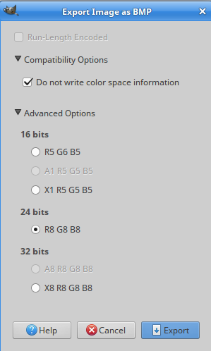

Vortex Manipulator
=

Mostly inspired by the wrist device worn by Captain Jack Harkness in _Dr Who_ and _Torchwood_, hence the name. However the design wandered somewhat from that initial idea so the look is a bit different. This is the idea I started with:


Mine is a little different, I needed more space to do what I want, so it is a bit fatter and it doesn't actually manipulate a time vortex (whatever that is). Instead it has the following functions:

 * Touch screen interface
 * Clock with optional beep and LED flash once a second, plus a function to set the time. It doesn't adjust automatically for daylight savings etc, but there is a UI to set the time manually.
 * Compass
 * Graphics demo
 * Dalek detector
 * Picture gallery (displays pictures from the SD card)
 * Heart rate monitor, including display graph and data log to SD card.
 * Sleep (power save) function, wakes up when the power button is pressed.
 * Notifications board. Messages from a Bluetooth device (eg a phone) display here.

[](https://youtu.be/WImzifKEVy0)

[Lots more details here](https://github.com/RogerParkinson/vortex-manipulator)

Hardware consists of a Teensy 3.2 mounted on a custom board [the Main Board](eagle/MainBoard/Readme.md) which contains circuitry for charging the attached LiPo battery when the USB port is connected, and an LSM303 to provide compass and accelerometer functions.

A second [ILI9341 custom connector board](eagle/ILI9341-Touch-connector/Readme.md) connects to an ILI9341 touch screen. This board has a touch controller and a connector strip that matches the strip on the side of the main board.

There are some configuration settings stored on the SD card (file is hconfig.txt) which consists of the time zone, low pulse and high pulse rates. The pulse rates are used by the HRM to sound alarms if the pulse is outside that range. The time zone is used for the clock (except it isn't actually used now). The other files on the SD card are bmp files used for the picture gallery. These must be 240x320 images. All of these files are in the SDBackup directory.

Perhaps more importantly it is a development _platform_. There is plenty of spare capacity in the Teensy and there is still plenty of room in the assembly to add more stuff. The Main Board has connectors to unused pins on the Teensy as well. An example of adding more stuff is the heart rate monitor. I got hold of a better one which uses an I2C interface and, hardware-wise, it was simple to add the extra connections to the SDA and SCL for it, then a bit more programming and the job was done.

The assembly is a mix of leather and a 3D printed frame.

Parts
-

 * [Teensy 3.2](https://www.pjrc.com/store/teensy32.html) microprocessor board
 * [LSM303](http://nz.element14.com/stmicroelectronics/lsm303dlhc/sensor-3-ch-accel-mag-mod-14lga/dp/2068595) Compass/accelerometer IC *
 * [SD Card Reader](https://www.aliexpress.com/item/Free-Shipping-5PCS-67840-8001-Conn-SD-Card-HDR-9-POS-Solder-RA-SMD-Embossed-T/32651979617.html?spm=2114.01010208.3.8.SHXu2I&ws_ab_test=searchweb0_0,searchweb201602_3_10152_10065_10151_10068_436_10136_10157_10137_10060_10138_10155_10062_10156_10154_10056_10055_10054_10059_100032_100033_100031_10099_10103_10102_10096_10147_10052_10053_10050_10107_10142_10051_10084_10083_10080_10082_10081_10110_10175_10111_10112_10113_10114_10181_10037_10183_10182_10185_10033_10032_10078_10079_10077_10073_10070_10123,searchweb201603_2,ppcSwitch_4&btsid=7b9c1a86-e8c1-4082-b529-14cabbf02189&algo_expid=712bfc6c-3058-4115-9f9d-6d221787d2ec-1&algo_pvid=712bfc6c-3058-4115-9f9d-6d221787d2ec) *
 * [Lipo Battery 3.7v](https://www.aliexpress.com/item/3-7V-1000mah-753050-Lithium-Polymer-LiPo-Rechargeable-Battery-For-Mp3-MP4-MP5-DVD-PAD-mobile/32293277274.html?spm=2114.01010208.3.15.W3GGuF&ws_ab_test=searchweb0_0,searchweb201602_3_10152_10065_10151_10068_436_10136_10157_10137_10060_10138_10155_10062_10156_10154_10056_10055_10054_10059_100032_100033_100031_10099_10103_10102_10096_10147_10052_10053_10050_10107_10142_10051_10084_10083_10080_10082_10081_10110_10175_10111_10112_10113_10114_10181_10037_10183_10182_10185_10032_10078_10079_10077_10073_10070_10123,searchweb201603_2,ppcSwitch_4&btsid=7691371f-396d-424d-b6fc-32f0ece90527&algo_expid=46b76ba9-9c3b-4e16-846a-75c4c1e89c21-4&algo_pvid=46b76ba9-9c3b-4e16-846a-75c4c1e89c21)
 * [2.4" 240x320 SPI Serial TFT Color LCD Display Module+ILI9341 Touch Panel Screen](https://www.aliexpress.com/item/2-8-2-8-Inch-240x320-SPI-Serial-TFT-Color-LCD-Display-Module-Touch-Panel-Screen/32681743271.html?spm=2114.13010308.0.0.0kiaBY) Make sure you get a *touch* screen, there are screens in the same format/packing that just display with no touch.
 * [XPT2046 Touch Controller](https://www.aliexpress.com/item/Free-shipping-20pcs-lot-XPT2046-2046-TSSOP16-new-original/32639677099.html?spm=2114.13010608.0.0.BkDnSR) *
 * [MCP73811](https://www.aliexpress.com/item/100-new-origina-MCP73811T-420I-OT-battery-management-chip-73811-MCP73811-Free-shipping-best-match/32713220952.html?spm=2114.search0104.3.1.75a67645xuhfYb&ws_ab_test=searchweb0_0,searchweb201602_3_10065_10068_10547_319_317_10548_10696_10084_453_10924_10083_454_10925_10926_10618_10920_10921_10307_10922_537_536_5733313_5733211_10059_10884_5733113_10887_100031_321_5733413_322_10103_5733612_5733513,searchweb201603_2,ppcSwitch_0&algo_expid=36e5927f-8c98-4996-90c5-7ffab6aace2d-0&algo_pvid=36e5927f-8c98-4996-90c5-7ffab6aace2d) battery management chip *
 * [LP298X](http://www.datasheetcafe.com/lp298xs-datasheet-low-dropout-regulator/) voltage regulator *
 * [Speaker 8 ohm](https://www.aliexpress.com/item/Manufacturers-direct-sales-round-8-European-1W-speaker-1w8-European-speakers-8-European-1W-speaker-20mm/32777445698.html?spm=2114.10010108.1000014.5.zq1wAZ&traffic_analysisId=recommend_3035_null_null_null&scm=1007.13338.79672.000000000000000&pvid=fb37bd47-3760-417f-b739-e97fcb0411c1&tpp=1)
 * 2 LEDs (blue and green, or whatever colour you prefer)
 * 32.768Khz Crystal [soldered to the under side of the Teensy](https://www.pjrc.com/teensy/td_libs_Time.html) and a Coin Cell battery (CR2032) and holder.
 * [Switch](https://www.aliexpress.com/item/MINI-micro-Slide-Switch-On-OFF-2-Position-1P2T-SPDT-Miniature-Horizontal-Slide-Switch-SMD-7/32655484942.html?spm=2114.01010208.3.1.kFgw4d&ws_ab_test=searchweb0_0,searchweb201602_3_10152_10065_10151_10068_436_10136_10157_10137_10060_10138_10155_10062_10156_10154_10056_10055_10054_10059_100032_100033_100031_10099_10103_10102_10096_10147_10052_10053_10050_10107_10142_10051_10084_10083_10080_10082_10081_10110_10175_10111_10112_10113_10114_10181_10037_10183_10182_10185_10032_10078_10079_10077_10073_10070_10123,searchweb201603_2,ppcSwitch_4&btsid=4943b00a-2810-4553-922c-abebd41b5fcd&algo_expid=9ef925ce-c813-4853-b9b8-157b1cc2ff52-0&algo_pvid=9ef925ce-c813-4853-b9b8-157b1cc2ff52) *
 * [Button](https://www.aliexpress.com/item/Promotion-Amico-100-Pcs-6x6x4-5mm-Panel-PCB-Momentary-Tactile-Tact-Push-Button-Switch-4-Pin/32563399489.html?spm=2114.10010108.1000014.1.VHE2ua&traffic_analysisId=recommend_3035_null_null_null&scm=1007.13338.79672.000000000000000&pvid=3f217487-ecad-45bd-a56f-eb5fef49d540&tpp=1)
 * Various caps and resistors (see circuit diagrams for the boards)
 * [Heart Rate Monitor](https://www.aliexpress.com/item/Low-Power-MAX30102-Heart-Rate-Oxygen-Pulse-Breakout-for-Arduino-Replace-MAx30100/32892216359.html?spm=a2g0s.9042311.0.0.27424c4dQnQZ6O) MAX30102 based breakout board.
 
Those marked with * are all surface mounted (SMD) parts.
 
Making the Icons
-

I developed an interesting technique for generating the icons for this project and I put it in its own [project](https://github.com/RogerParkinson/MakeIcons).

The SD card
-

The project uses an SD Card and you'll find a copy of mine in the SDBackup directory. It includes some bmp files which are images displayed by the gallery app, a configuration file calle hconfig.txt and a log file called datalog.txt.

The configuration file is one line: 12,120,150,
the 12 was once a timezone but I no longer use that. 120 and 150 are heart rate limits. The display turns green when you pass 120 and red when you pass 150. For me green means I'm in a good exercise zone, but your numbers may be different.

You can add your own bmp files. As long as they are 240x320 BMP format they will display in the gallery. When I export mine from Gimp I use these settings:



Finally the datalog.txt file is a log of heart rates. The first column is a timestamp, then the beast per minute and finally the last interval between beats. It logs this every 10 minutes, the time is set in the setup() method in VortexManipulator.cpp:

```
intervals.create(10*60*1000L,new HRLogAction()); // 10 minutes
``` 


